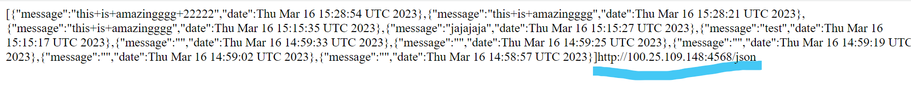
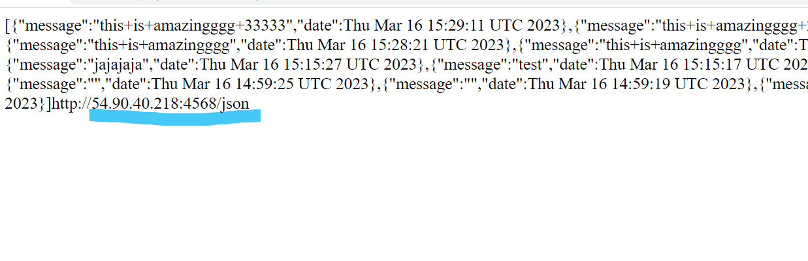

## TALLER DE DE MODULARIZACIÓN CON VIRTUALIZACIÓN E INTRODUCCIÓN A DOCKER Y A AWS


### Instalando

Según la arquitectura:


Se crean las máquinas virtuales en AWS:


Se accede desde las terminales y se colocan a correr los servicios:
LogService se usa el comando 

```
java -cp target/classes:target/dependency/* org.example.RESTLogService
```


Se instala y se pone a correr el servicio de mongo:


Y luego el servicio de RoundRobin con el comando

```
java -cp target/classes:target/dependency/* org.example.SparkWebServer
```


En este caso, se puede acceder a la dirección http://3.239.164.158:4567/ y se obtiene


Al enviar el mensaje se puede evidenciar que envía la peticion a una de las máquinas de LogService
implementando de forma efectiva el roundRobin







## Built With

* [Maven](https://maven.apache.org/) - Dependency Management


## Versioning

*  Se hizo uso de git para el manejo de versionamiento.

## Authors

* **Wilson Alirio Delgado Hernández** 

