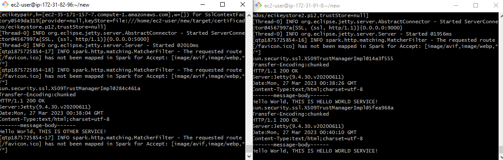
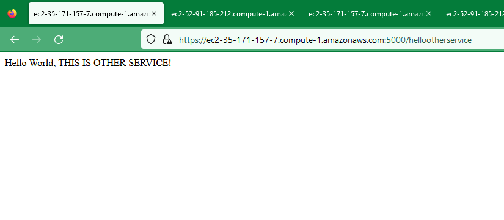

## TALLER DE DE MODULARIZACIÓN CON VIRTUALIZACIÓN E INTRODUCCIÓN A DOCKER Y A AWS


### Instalando

Según la arquitectura:


Se crean las máquinas virtuales en AWS:


En una se corre:

```
 java -cp target/classes:target/dependency/* org.example.HelloWorld
```

Y en la otra:

```
 java -cp target/classes:target/dependency/* org.example.OtherService
```



Se evidencia el acceso a la ruta en cada una:


Se evidencia la comunicación entre ambas usando http + SSL = https:




### Video
[Enlace Video](https://pruebacorreoescuelaingeduco-my.sharepoint.com/:v:/g/personal/wilson_delgado_mail_escuelaing_edu_co/EVmt1kjDqLZMiDteXk6av3YB6UA05A0Paun37cIWm-WuSA?e=OlcdUw)


## Built With

* [Maven](https://maven.apache.org/) - Dependency Management


## Versioning

*  Se hizo uso de git para el manejo de versionamiento.

## Authors

* **Wilson Alirio Delgado Hernández** 

