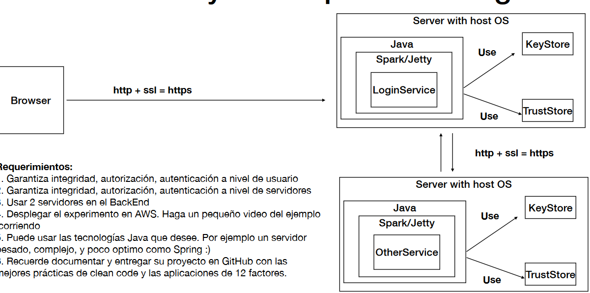

## TALLER DE DE MODULARIZACIÓN CON VIRTUALIZACIÓN E INTRODUCCIÓN A DOCKER Y A AWS


### Instalando
Descarga o clona el repositorio y ejecuta

```
mvn package
```

luego puedes ejecutar desde tu IDE o en la terminal

El cual se encargará de hacer la conexión a la base de datos y guardar la información.

```
java -cp .\target\classes\ org.example.RESTLogService
```

El cual va a permitir el acceso a los archivos estáticos como el index.

y también ejecutar 

```
java -cp .\target\classes\ org.example.SparkWebServer
```

El cual va a permitir el acceso a los archivos estáticos como el index.

Luego, puedes ingresar a http://localhost:4567 o http://localhost:4567/index.html donde verás:



Al enviar información se obtiene:


Se crea la imagen

```
docker build --tag mydocker .
```

Y el docker compose

```
docker-compose up -d
```

Se evidencia como está arriba el contenedor:


En el puerto 27017 del localhost se puede acceder al contenedor, como se evidencia anteriormente al obtener la respuesta de la base de datos.


## Built With

* [Maven](https://maven.apache.org/) - Dependency Management


## Versioning

*  Se hizo uso de git para el manejo de versionamiento.

## Authors

* **Wilson Alirio Delgado Hernández** 

